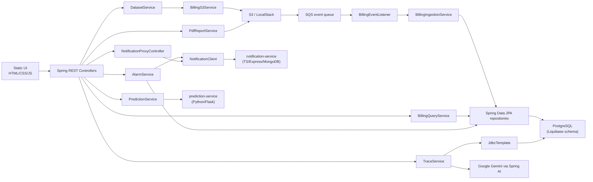
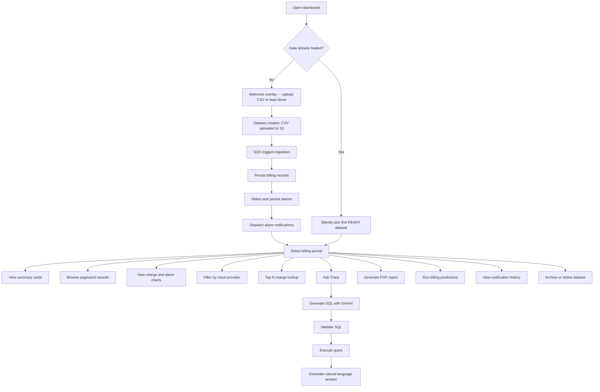

## High-Level Architecture



## Primary Workflows



## Repository Map

```
blueprint/
├── notification-service/     # TypeScript notification microservice (Express/MongoDB)
│   ├── src/                  # TypeScript source (server, controllers, services, models)
│   └── public/               # Notification dashboard UI
├── prediction-service/       # Python prediction microservice (Flask/scikit-learn)
│   ├── app.py                # Flask app with /predict endpoint
│   └── Dockerfile
├── docs-site/                # This documentation site (Astro/Starlight)
├── scripts/                  # Docker and JAR run scripts
└── src/main/java/com/azeem/blueprint/
    ├── client/          # HTTP clients for external services
    ├── config/          # Spring configuration beans
    ├── controller/      # REST controllers — thin layer, delegate to services
    ├── entity/          # JPA entities mapped to database tables
    ├── etl/             # CSV/TSV parsing, billing record assembly, batch writer
    ├── exception/       # Custom exceptions and global exception handler
    ├── listener/        # SQS event listeners (event-driven ingestion)
    ├── mapper/          # Converts between entities and domain models
    ├── model/           # Domain model records/classes (not persisted directly)
    ├── repository/      # Spring Data JPA repositories
    ├── service/         # Business logic, organised by domain
    ├── util/            # Shared utilities
    └── validation/      # Custom Jakarta Bean Validation annotations
```
