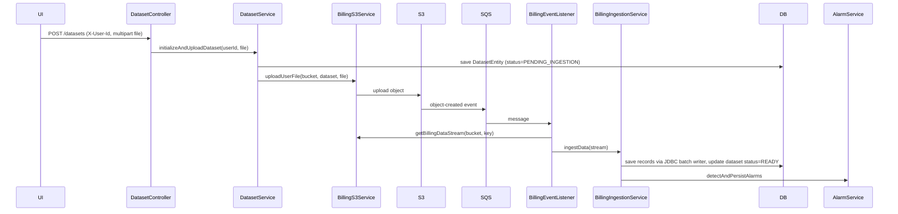

## Overview

Users upload billing CSV files which are processed asynchronously through an S3 → SQS event-driven pipeline.

## User Flow

1. User chooses a `.csv` file from the dashboard navbar (or the welcome overlay).
2. User clicks **Upload**.
3. Frontend posts multipart form data to `POST /datasets` with `X-User-Id` header.
4. Backend creates a `Dataset` tracking record with status `PENDING_INGESTION`.
5. Backend uploads the file to S3 under path `ownerUserId/datasetId/filename.csv`.
6. S3/LocalStack emits object-created event to SQS.
7. `BillingEventListener` receives the message and ingests the object.
8. On successful ingestion the dataset transitions to `READY`.

## Backend Flow

## Key Files

| File | Role |
|------|------|
| `controller/DatasetController.java` | `POST /datasets`, `GET /datasets`, `DELETE`, `PATCH archive/restore` |
| `service/dataset/DatasetService.java` | Dataset creation, S3 upload orchestration |
| `etl/JdbcBillingBatchWriter.java` | Raw JDBC batch INSERT for high-performance ingestion |
| `service/billing/BillingS3Service.java` | S3 upload/download/error-log operations |
| `listener/BillingEventListener.java` | `@SqsListener("billing-event-queue")` |
| `service/billing/BillingIngestionService.java` | Parses, persists, and triggers alarms |

## Dataset Status Lifecycle

| Status | Meaning |
|--------|---------|
| `PENDING_INGESTION` | Dataset record created; S3 upload complete; awaiting SQS processing |
| `READY` | Ingestion complete; billing records and alarms are queryable |

## Edge Cases

- `CsvFileValidator` accepts only non-empty files whose original filename ends with `.csv`.
- `BillingS3Service.uploadUserFile` refuses duplicate S3 object keys by returning early if the object exists.
- Ingestion catches per-row parse errors, records them in an error log buffer, and continues.
- If any row failures occur, `BillingEventListener` uploads an error log to `error-logs/{billingPeriod}-errors.log`.
- The frontend waits two seconds after upload before polling periods and refreshing the dashboard.
