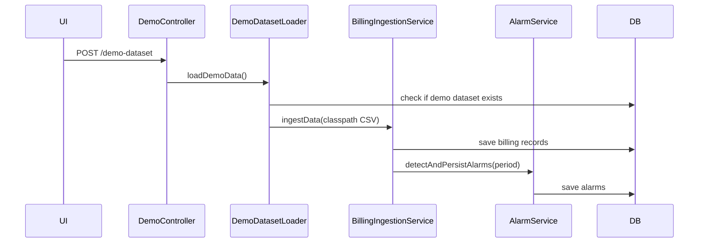

## Overview

The `Dataset` domain model is the central tracking entity. Every billing record, alarm, and PDF report is scoped to a dataset ID.

## Dataset Lifecycle

- **Active** — default state; visible in `GET /datasets`; queryable for records, alarms, etc.
- **Archived** — hidden from main listing; visible via `GET /datasets/archived`; can be restored.
- **Deleted** — permanent removal via `DELETE`; cascades to billing records, alarms, and PDF reports via foreign key constraints.

## API

| Method | Path | Header | Response |
|--------|------|--------|----------|
| `POST` | `/datasets` | `X-User-Id: String` | `Dataset` |
| `GET` | `/datasets` | `X-User-Id: UUID` | `List<Dataset>` (active only) |
| `GET` | `/datasets/{datasetId}` | — | `Dataset` |
| `DELETE` | `/datasets/{datasetId}` | `X-User-Id: UUID` | 204 No Content |
| `PATCH` | `/datasets/{datasetId}/archive` | `X-User-Id: UUID` | 204 No Content |
| `PATCH` | `/datasets/{datasetId}/restore` | `X-User-Id: UUID` | 204 No Content |
| `GET` | `/datasets/archived` | `X-User-Id: UUID` | `List<Dataset>` |

## Frontend Features

- **Dataset switcher** — `<select>` in the navbar with filename, upload date, and status
- **Delete Dataset** — button with confirmation dialog
- **Archive Dataset** — button with confirmation dialog
- **Show Archived** — toggle to switch between active and archived views
- **Restore** — button visible on archived datasets

## Demo Data

Users can load bundled demo data without their own CSV:

The demo dataset ID is fixed as `00000000-0000-0000-0000-000000000000`. The loader skips repeat ingestion if the demo dataset already exists.
