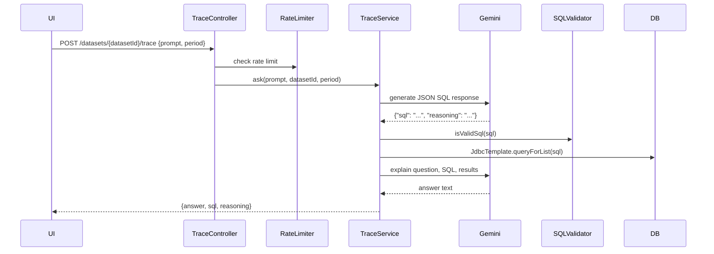

## Overview

Trace lets users ask natural-language questions about billing data. It generates validated SQL, executes it against the database, and returns a plain-English answer.

## Flow



## API

```http
POST /datasets/{datasetId}/trace
Content-Type: application/json

{
  "prompt": "Which cloud providers have the highest total charges?",
  "period": "dummy-data"
}
```

Response:
```json
{
  "answer": "...",
  "sql": "select ...",
  "reasoning": "..."
}
```

## AI Configuration

- **Provider**: Spring AI Google GenAI starter
- **Model**: `gemini-2.5-flash`
- **Temperature**: `0.1`
- **Location**: `us-central1`

## Prompt Behavior

1. Gemini is instructed to act as a PostgreSQL query generator scoped to the given dataset
2. It must return only JSON with `sql` and `reasoning`
3. Prompt includes the hardcoded database schema
4. All queries must include the selected `billing_period`
5. A second Gemini call turns SQL results into a billing analyst answer

## Safety Boundaries

- `SqlValidationService` only allows SQL strings starting with `select`
- It blocks strings containing `insert`, `update`, `delete`, `drop`, and `alter`
- `RateLimiter` constrains query frequency

## Key Files

| File | Role |
|------|------|
| `TraceController.java` | `POST /datasets/{datasetId}/trace` |
| `TraceService.java` | Prompt orchestration, Gemini calls, validation, explanation |
| `SchemaService.java` | Hardcoded schema string provided to Gemini |
| `SqlValidationService.java` | Lightweight SQL safety check |
| `QueryExecutionService.java` | Executes generated SQL with `JdbcTemplate` |
| `RateLimiter.java` | Rate limiting for Trace queries |
