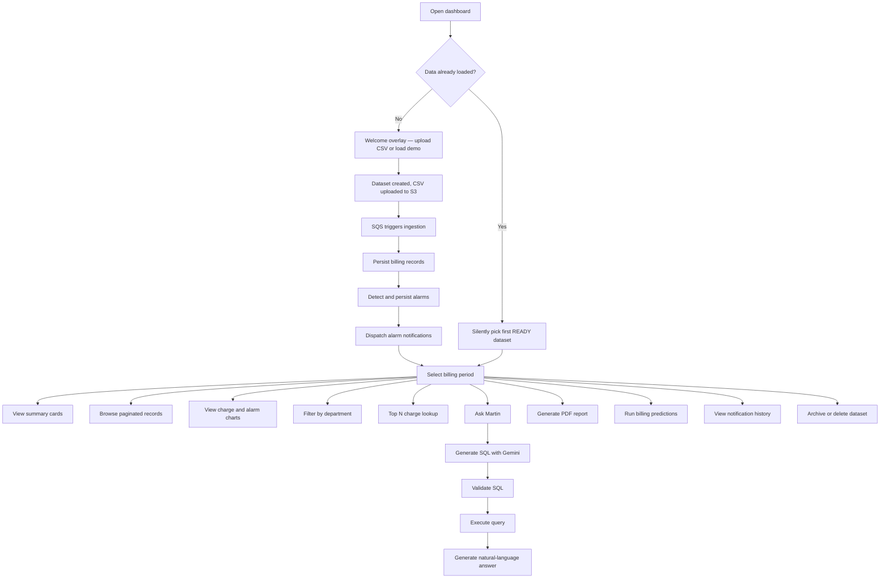
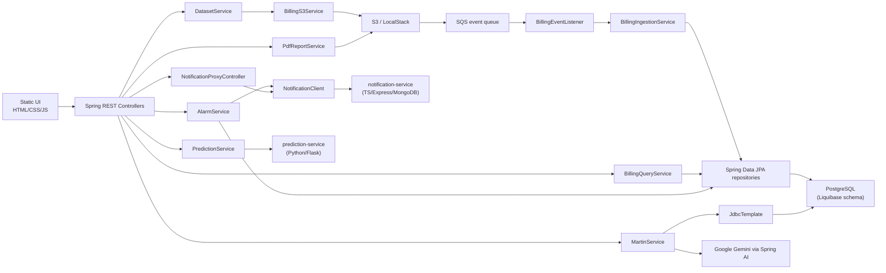
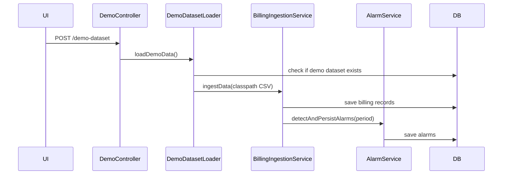
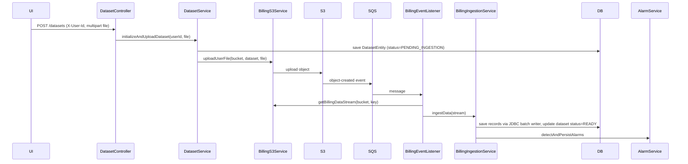
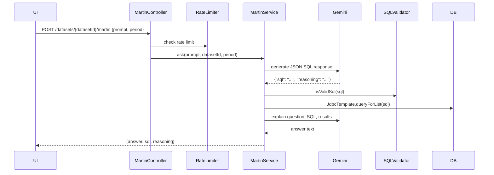

# Blueprint Product and System Documentation

This document explains what Blueprint currently is, how it works, and how the major workflows are implemented. It documents implemented code and clearly labels incomplete or scaffolded systems.

Last updated: June 7, 2026

## Project Overview

Blueprint is a telecom billing intelligence dashboard. It helps users ingest telecom billing CSV data, store it in PostgreSQL, inspect records by period and department, summarize charges, surface budget alarms, generate PDF reports, forecast future costs, and ask natural-language billing questions through an AI assistant named Martin.

The system consists of three services:

1. **Monolith** — a full-stack Spring Boot application with:
   - A static HTML/CSS/JavaScript frontend served directly by Spring Boot.
   - REST APIs for dataset management, records, summaries, departments, periods, alarms, demo loading, PDF reports, predictions, notifications, corporate info, CSV export, and Martin chat. All data APIs are scoped to a dataset ID.
   - PostgreSQL persistence through Spring Data JPA, with schema managed by Liquibase.
   - CSV ingestion through OpenCSV and raw JDBC batch writes for performance.
   - Event-driven upload processing through S3 object-created events delivered to SQS.
   - Local S3/SQS emulation through LocalStack in Docker Compose.
   - Google Gemini integration through Spring AI.
   - OpenAPI/Swagger documentation via springdoc-openapi.
   - Response caching via Spring Cache.
   - A `NotificationClient` that dispatches individual alarm payloads to the notification microservice.
   - A `PredictionService` that proxies billing data to the prediction microservice.

2. **Notification Microservice** (`notification-service/`) — a Node.js/Express/TypeScript service:
   - Receives alarm payloads via `POST /notify` with Zod validation.
   - Delivers notifications via AWS SES email and Slack webhooks.
   - Stores notification delivery history in MongoDB.
   - Serves a notification dashboard UI (`public/`).

3. **Prediction Microservice** (`prediction-service/`) — a Python/Flask service:
   - Receives historical billing data via `POST /predict`.
   - Performs linear regression forecasting using scikit-learn.
   - Returns predicted charges for future billing periods.

Current maturity: functional demo with real ETL, persistence, dataset lifecycle (archive/restore/delete), alarms with notification dispatch, multi-dataset management, Liquibase-managed schema, PDF report generation, billing predictions, CSV export, complete test coverage, and AI query execution. Remaining gaps: no real authentication, Martin SQL validation is string-based.

## Target Users

- Internal finance or operations teams reviewing telecom spend.
- Technical reviewers evaluating ETL, event-driven ingestion, and AI analytics patterns.
- Demo users who do not have their own CSV and can load bundled demo data.

There is no implemented multi-user account system, tenant model, roles, or permissions. All requests use a stable guest UUID (`00000000-0000-0000-0000-000000000001`).

## Primary Workflows



## Architecture Overview

### High-Level Architecture



### Frontend Responsibilities

The frontend in `src/main/resources/static` is responsible for:

- Rendering the dashboard, login, info, and 404 pages.
- Showing a welcome overlay on first visit and silently restoring the last READY dataset on return visits.
- Providing a dataset switcher in the navbar to switch between uploaded datasets.
- Calling backend REST APIs with `fetch`, including an `X-User-Id` header for dataset-scoped requests.
- Rendering Chart.js charts (department charges, alarm severity, billing predictions).
- Showing skeleton loaders during async fetches and toast notifications on errors.
- Handling client-side page interactions: period selection, pagination, upload, dataset switching, modal open/close, Martin chat, notifications, archive/restore.
- Dataset lifecycle actions: delete (with confirmation), archive, view archived, restore.
- PDF report generation and download.
- Notification history modal with delivery stats.

It has no build step, package manager, client-side router, frontend state library, auth provider, or component system.

### Backend Responsibilities

The Spring Boot app is responsible for:

- Serving static files.
- Provisioning `AppUser` records for incoming `X-User-Id` values on demand.
- Accepting CSV uploads, creating `Dataset` tracking records, and streaming files to S3.
- Listening for SQS messages triggered by S3 object creation.
- Parsing and ingesting CSV records into the correct dataset.
- Persisting billing records and alarms, scoped by dataset.
- Serving analytics queries scoped to a dataset.
- Generating AI SQL and explanations through Martin.
- Dispatching individual alarm notifications to the notification microservice after persistence.
- Proxying notification history queries to the notification microservice.
- Proxying billing prediction requests to the prediction microservice.
- Generating PDF billing reports and storing them in S3.
- Managing corporate branding info for PDF reports.
- Exporting billing data as CSV.
- Dataset lifecycle management: archiving, restoring, and deleting datasets.
- Handling validation and domain exceptions.

## Repository Map

```text
blueprint/
├── notification-service/
│   ├── src/
│   │   ├── server.ts
│   │   ├── config/
│   │   │   ├── aws.ts
│   │   │   └── db.ts
│   │   ├── controllers/
│   │   │   └── notification.controller.ts
│   │   ├── models/
│   │   │   └── notification.model.ts
│   │   ├── services/
│   │   │   ├── email.service.ts
│   │   │   ├── notification.service.ts
│   │   │   └── slack.service.ts
│   │   └── validation/
│   │       └── notification.schema.ts
│   └── public/
│       ├── index.html
│       ├── app.js
│       └── style.css
├── prediction-service/
│   ├── app.py
│   ├── requirements.txt
│   └── Dockerfile
├── src/main/java/com/azeem/blueprint/
│   ├── BlueprintApplication.java
│   ├── client/
│   │   └── NotificationClient.java
│   ├── config/
│   │   ├── AlarmConfig.java
│   │   ├── BillingReaderConfig.java
│   │   ├── CacheConfig.java
│   │   ├── OpenApiConfig.java
│   │   └── SecurityConfig.java
│   ├── controller/
│   │   ├── AlarmController.java
│   │   ├── BillingController.java
│   │   ├── CorporateInfoController.java
│   │   ├── DatasetController.java
│   │   ├── DemoController.java
│   │   ├── MartinController.java
│   │   ├── NotificationProxyController.java
│   │   ├── PdfController.java
│   │   └── PredictionController.java
│   ├── entity/
│   │   ├── AlarmEntity.java
│   │   ├── AppUserEntity.java
│   │   ├── BillingRecordEntity.java
│   │   ├── CorporateInfoEntity.java
│   │   ├── DatasetEntity.java
│   │   └── PdfReportEntity.java
│   ├── etl/
│   │   ├── BillingRecordAssembler.java
│   │   ├── CsvBillingReader.java
│   │   ├── CsvExportService.java
│   │   ├── JdbcBillingBatchWriter.java
│   │   ├── SummaryBuilder.java
│   │   └── TsvBillingReader.java
│   ├── exception/
│   │   ├── ErrorResponse.java
│   │   ├── GlobalExceptionHandler.java
│   │   ├── core/
│   │   │   ├── BillingDataIngestionException.java
│   │   │   ├── BillingDataLoadException.java
│   │   │   ├── BillingDataNotFoundException.java
│   │   │   ├── BillingException.java
│   │   │   ├── CorporateInfoNotFoundException.java
│   │   │   ├── DepartmentNotFoundException.java
│   │   │   ├── MartinResponseInvalidException.java
│   │   │   ├── PdfGenerationException.java
│   │   │   └── PdfReportNotFoundException.java
│   │   ├── infra/
│   │   │   ├── DatasetNotFoundException.java
│   │   │   ├── MalformedS3ObjectKeyException.java
│   │   │   └── S3SqsPipelineIngestionException.java
│   │   └── web/
│   │       ├── ApiException.java
│   │       └── QueryLimitExceededException.java
│   ├── listener/
│   │   └── BillingEventListener.java
│   ├── mapper/
│   │   ├── AlarmMapper.java
│   │   ├── AppUserMapper.java
│   │   ├── BillingRecordMapper.java
│   │   ├── CorporateInfoMapper.java
│   │   ├── DatasetMapper.java
│   │   └── PdfReportMapper.java
│   ├── model/
│   │   ├── alarm/
│   │   │   ├── Alarm.java
│   │   │   ├── AlarmScope.java
│   │   │   └── AlarmSeverity.java
│   │   ├── billing/
│   │   │   ├── BillingRecord.java
│   │   │   ├── BillingSummary.java
│   │   │   ├── Department.java
│   │   │   └── IngestionResult.java
│   │   ├── dataset/
│   │   │   └── Dataset.java
│   │   ├── martin/
│   │   │   ├── MartinRequest.java
│   │   │   ├── MartinResponse.java
│   │   │   └── SqlResponse.java
│   │   ├── prediction/
│   │   │   ├── DataPoint.java
│   │   │   ├── PredictionRequest.java
│   │   │   └── PredictionResponse.java
│   │   ├── report/
│   │   │   ├── CorporateInfo.java
│   │   │   ├── CorporateInfoRequest.java
│   │   │   └── PdfReport.java
│   │   └── user/
│   │       └── AppUser.java
│   ├── repository/
│   │   ├── AlarmRepository.java
│   │   ├── AppUserRepository.java
│   │   ├── BillingRecordRepository.java
│   │   ├── CorporateInfoRepository.java
│   │   ├── DatasetRepository.java
│   │   └── PdfReportRepository.java
│   ├── service/
│   │   ├── AppUser/
│   │   │   └── AppUserService.java
│   │   ├── alarm/
│   │   │   ├── AlarmDetectionService.java
│   │   │   └── AlarmService.java
│   │   ├── billing/
│   │   │   ├── BillingIngestionService.java
│   │   │   ├── BillingQueryService.java
│   │   │   └── BillingS3Service.java
│   │   ├── dataset/
│   │   │   ├── DatasetService.java
│   │   │   └── demo/
│   │   │       └── DemoDatasetLoader.java
│   │   ├── martin/
│   │   │   ├── MartinService.java
│   │   │   ├── QueryExecutionService.java
│   │   │   ├── RateLimiter.java
│   │   │   ├── SchemaService.java
│   │   │   └── SqlValidationService.java
│   │   ├── prediction/
│   │   │   └── PredictionService.java
│   │   └── report/
│   │       ├── CorporateInfoService.java
│   │       ├── LocalJavaPdfRenderer.java
│   │       ├── PdfRenderer.java
│   │       ├── PdfReportService.java
│   │       └── PdfStorageService.java
│   ├── util/
│   │   └── BillingFileReader.java
│   └── validation/
│       ├── BillingPeriod.java
│       ├── BillingPeriodFormatValidator.java
│       ├── CsvFileValidator.java
│       └── ValidCsvFile.java
```

## Core Features

### 1. Demo Data Loading

Purpose: allow the dashboard to work without a user-provided CSV.

User flow:

1. User opens the dashboard for the first time and sees the welcome overlay.
2. User clicks `Load Demo Data` on the overlay (or inside the Help modal).
3. Frontend sends `POST /demo-dataset`.
4. Backend ingests the bundled `dummy-data.csv` as a fixed demo dataset.
5. Welcome overlay disappears and the dashboard refreshes.

Backend flow:



Important files:

| File | Role |
|---|---|
| `src/main/resources/dummy-data.csv` | Bundled seed dataset. |
| `service/dataset/demo/DemoDatasetLoader.java` | Loads seed CSV. |
| `controller/DemoController.java` | Exposes `POST /demo-dataset`. |
| `src/main/resources/static/js/dashboard.js` | Calls `/demo-dataset` and refreshes UI. |

Status: implemented.

Constraints:

- The loader skips repeat ingestion if the demo dataset already exists.
- `dummy-data` is explicitly allowed by `BillingPeriodFormatValidator` even though normal periods must be `YYYY-MM`.
- The demo dataset ID is fixed as `00000000-0000-0000-0000-000000000000`.

### 2. CSV Upload and Event-Driven Ingestion

Purpose: allow users to upload billing CSVs and process them asynchronously through object storage events.

User flow:

1. User chooses a `.csv` file from the dashboard navbar (or the welcome overlay).
2. User clicks `Upload`.
3. Frontend posts multipart form data to `POST /datasets` with `X-User-Id` header.
4. Backend creates a `Dataset` tracking record with status `PENDING_INGESTION`.
5. Backend uploads the file to S3 under path `ownerUserId/datasetId/filename.csv`.
6. S3/LocalStack emits object-created event to SQS.
7. `BillingEventListener` receives the message and ingests the object.
8. On successful ingestion the dataset transitions to `READY`.

Backend flow:



Important files:

| File | Role |
|---|---|
| `controller/DatasetController.java` | `POST /datasets`, `GET /datasets`, `GET /datasets/{id}`, `DELETE`, `PATCH archive/restore`, `GET /archived`. |
| `service/dataset/DatasetService.java` | Dataset creation, S3 upload orchestration, listing, archiving, deletion. |
| `etl/JdbcBillingBatchWriter.java` | Raw JDBC batch INSERT for high-performance ingestion. |
| `BillingS3Service.java` | S3 upload/download/error-log operations. |
| `BillingEventListener.java` | `@SqsListener("billing-event-queue")`. |
| `BillingIngestionService.java` | Parses, persists, and triggers alarms. |
| `docker-compose.dev.yml` | Creates LocalStack S3/SQS and notification bridge. |

Status: implemented for Docker/LocalStack.

Dataset status lifecycle:

| Status | Meaning |
|---|---|
| `PENDING_INGESTION` | Dataset record created; S3 upload complete; awaiting SQS processing. |
| `READY` | Ingestion complete; billing records and alarms are queryable. |

Edge cases and constraints:

- `CsvFileValidator` accepts only non-empty files whose original filename ends with `.csv`.
- `BillingS3Service.uploadUserFile` refuses duplicate S3 object keys by returning early if the object exists.
- Ingestion catches per-row parse errors, records them in an error log buffer, and continues.
- If any row failures occur, `BillingEventListener` uploads an error log to `error-logs/{billingPeriod}-errors.log`.
- The frontend waits two seconds after upload before polling periods and refreshing the dashboard.

### 3. Dataset Management

Purpose: let users list, switch between, archive, restore, and delete uploaded datasets.

The `Dataset` domain model is the central tracking entity. Every billing record, alarm, and PDF report is scoped to a dataset ID.

Dataset API:

| Method | Path | Auth header | Response |
|---|---|---|---|
| `POST /datasets` | Upload new CSV | `X-User-Id: String` | `Dataset` |
| `GET /datasets` | List active (non-archived) datasets | `X-User-Id: UUID` | `List<Dataset>` |
| `GET /datasets/{datasetId}` | Get a single dataset | none | `Dataset` |
| `DELETE /datasets/{datasetId}` | Permanently delete a dataset | `X-User-Id: UUID` | 204 No Content |
| `PATCH /datasets/{datasetId}/archive` | Archive a dataset (soft-delete) | `X-User-Id: UUID` | 204 No Content |
| `PATCH /datasets/{datasetId}/restore` | Restore an archived dataset | `X-User-Id: UUID` | 204 No Content |
| `GET /datasets/archived` | List archived datasets | `X-User-Id: UUID` | `List<Dataset>` |

Dataset lifecycle:

- **Active** — default state; visible in `GET /datasets`; queryable for records, alarms, etc.
- **Archived** — hidden from main listing; visible via `GET /datasets/archived`; can be restored.
- **Deleted** — permanent removal via `DELETE`; cascades to billing records, alarms, and PDF reports via foreign key constraints.

Frontend dataset features:

- Dataset switcher `<select>` in the navbar.
- Delete Dataset button with confirmation dialog.
- Archive Dataset button with confirmation dialog.
- "Show Archived" toggle to switch between active and archived views.
- Restore button visible on archived datasets.

Important files:

| File | Role |
|---|---|
| `controller/DatasetController.java` | Dataset CRUD + lifecycle endpoints. |
| `service/dataset/DatasetService.java` | Dataset creation, listing, archiving, restoration, deletion. |
| `entity/DatasetEntity.java` | JPA entity for `datasets` table with `archived` column. |
| `model/dataset/Dataset.java` | Domain record: `id`, `ownerUserId`, `billingPeriod`, `sourceFilename`, `s3ObjectKey`, `uploadedAt`, `status`, `archived`. |
| `mapper/DatasetMapper.java` | Entity/domain mapping. |
| `repository/DatasetRepository.java` | `findActiveDatasets`, `findArchivedDatasets`, `findByIdAndOwnerUserId`, `deleteByIdAndOwnerUserId`. |

Status: implemented.

### 4. Billing Records and Summary Analytics

Purpose: expose stored billing records and aggregate analytics, scoped to a dataset.

Backend implementation:

| Layer | Files |
|---|---|
| Controller | `BillingController.java` (under `/datasets/{datasetId}`) |
| Service | `BillingQueryService.java` |
| Repository | `BillingRecordRepository.java` |
| Entity | `BillingRecordEntity.java` |
| Domain model | `BillingRecord.java`, `BillingSummary.java` |
| Aggregation | `SummaryBuilder.java` |
| Mapper | `BillingRecordMapper.java` |
| Export | `CsvExportService.java` |

User-facing dashboard areas:

- Latest period summary cards.
- All records table with pagination.
- Charges by department Chart.js bar chart.
- Department filter table.
- Top N highest charges table.
- CSV export of billing data.

APIs involved:

| Endpoint | Used by frontend | Behavior |
|---|---|---|
| `GET /datasets/{id}/records/periods` | yes | Populates period dropdown. Returns `List<String>`. |
| `GET /datasets/{id}/records/periods/{billingPeriod}` | yes | Paged records table and department chart source. |
| `GET /datasets/{id}/summary/periods/{billingPeriod}` | yes | Summary cards. |
| `GET /datasets/{id}/records/departments/{department}` | yes | Department filter table. |
| `GET /datasets/{id}/top/{n}` | yes | Top N table. |
| `GET /datasets/{id}/records` | no current frontend use | All records across periods. |
| `GET /datasets/{id}/summary` | yes (predictions) | Summary across all records. |

Status: implemented.

Constraints:

- `GET /top/{n}` validates `n` between 1 and 100 via `@Min`/`@Max`.
- Period routes validate `YYYY-MM` format or the literal `dummy-data`.
- Department routes validate `@NotBlank` on the path variable.

### 5. Alarm Detection and Notification Dispatch

Purpose: detect telecom spend anomalies after ingestion, persist them, and notify an external service.

Alarm scopes:

| Scope | Implementation |
|---|---|
| `DEPARTMENT` | Department total exceeds configured monthly limit. |
| `INDIVIDUAL` | Individual record charge exceeds low/medium/high thresholds. |
| `ACCOUNT` | Grand total exceeds configured account thresholds. |

Configuration in `application.yaml`:

```yaml
alarm:
  department:
    monthlyLimit: 7500
  individual:
    low: 250
    medium: 370
    high: 500
  account:
    low: 45000
    high: 60000
```

After persisting new alarms, `AlarmService` calls `notifyQuietly()`, which dispatches the alarm list to `NotificationClient`. The client sends one `POST /notify` per alarm to `${NOTIFICATION_SERVICE_URL:http://localhost:3001}`. Each payload matches the Zod schema defined in `notification-service/src/validation/notification.schema.ts`. Failures are caught and logged as `WARN` — they never propagate or roll back alarm persistence.

Notification payload fields (matching Zod schema):

| Field | Type | Notes |
|---|---|---|
| `alarmId` | String | UUID business key |
| `datasetId` | String | UUID |
| `billingPeriod` | String | e.g. `2026-01` |
| `severity` | String | `LOW`, `MEDIUM`, or `HIGH` |
| `title` | String | Human-readable alarm type |
| `message` | String | Explanation text |
| `recipients` | Object | `{ email: string[], slackWebhooks: string[] }` |

Important files:

| File | Role |
|---|---|
| `AlarmDetectionService.java` | Pure detection logic over billing records. |
| `AlarmService.java` | Loads records, deduplicates, persists alarms, triggers notification. |
| `client/NotificationClient.java` | HTTP client for `POST /notify` (one request per alarm). |
| `notification-service/src/validation/notification.schema.ts` | Zod schema — the source of truth for the payload contract. |
| `AlarmRepository.java` | Alarm queries. |
| `AlarmController.java` | Alarm API endpoints under `/datasets/{datasetId}`. |

Frontend flow:

- Dashboard calls `/datasets/{id}/alarms/{billingPeriod}` to update the red alarm button count.
- Alarm modal lists all alarms for selected period.
- Alarm severity chart groups returned alarms by LOW, MEDIUM, HIGH, UNKNOWN.
- Notifications modal shows delivery history fetched via `/api/notifications`.

Status: implemented.

Known implementation caveats:

- Alarm detection is chunked by 1,000 records. Department totals and account totals are computed per chunk, not per full dataset-period. This can produce false negatives or duplicates for datasets larger than one chunk. There is a TODO in `AlarmService` for this.
- Department detection only maps a fixed set of departments in the `Department` enum. Free-form department strings in billing records that do not map to an enum value are skipped for department-scoped alarms.

### 6. Martin AI Analytics

Purpose: let users ask natural-language questions about billing data scoped to the active dataset.

Backend flow:



Important files:

| File | Role |
|---|---|
| `MartinController.java` | Exposes `POST /datasets/{datasetId}/martin`. |
| `MartinService.java` | Prompting, Gemini calls, validation orchestration, explanation generation. |
| `SchemaService.java` | Hardcoded schema string provided to Gemini. |
| `SqlValidationService.java` | Lightweight SQL safety check. |
| `QueryExecutionService.java` | Executes generated SQL with `JdbcTemplate`. |
| `RateLimiter.java` | Rate limiting for Martin queries. |
| `MartinRequest.java`, `MartinResponse.java`, `SqlResponse.java` | Request/response models. |

Prompt behavior:

- Gemini is instructed to act as a PostgreSQL query generator scoped to the given dataset.
- Gemini must return only JSON with `sql` and `reasoning`.
- Prompt includes the hardcoded database schema.
- Prompt instructs that all queries must include the selected `billing_period`.
- A second Gemini call turns SQL results into a billing analyst answer.

Status: implemented, but security-hardening incomplete.

Safety boundaries:

- `SqlValidationService` only allows SQL strings starting with `select`.
- It blocks strings containing `insert`, `update`, `delete`, `drop`, and `alter`.
- There is a TODO to use a SQL AST parser such as JSQLParser.
- `RateLimiter` constrains query frequency.

### 7. PDF Report Generation

Purpose: generate PDF billing reports with corporate branding.

User flow:

1. User selects a billing period and clicks "Generate PDF".
2. Frontend sends `POST /datasets/{datasetId}/reports/pdf?period=YYYY-MM`.
3. Backend generates a PDF using `LocalJavaPdfRenderer`, stores it in S3.
4. Frontend receives the report metadata and triggers a download via `GET /datasets/{datasetId}/reports/pdf/{reportId}`.

Important files:

| File | Role |
|---|---|
| `PdfController.java` | `POST /pdf` (generate) and `GET /pdf/{reportId}` (download). |
| `PdfReportService.java` | Orchestrates report generation and download. |
| `LocalJavaPdfRenderer.java` | Pure Java PDF renderer (implements `PdfRenderer`). |
| `PdfStorageService.java` | S3 storage for generated PDFs. |
| `CorporateInfoService.java` | Manages company branding for report headers. |
| `CorporateInfoController.java` | `GET` and `PUT /users/{userId}/corporate-info`. |

Status: implemented.

### 8. Billing Predictions

Purpose: forecast future billing charges based on historical data.

User flow:

1. User selects 3+ datasets from the prediction modal.
2. Frontend sends `POST /api/predictions` with dataset IDs.
3. Monolith gathers historical billing summaries and sends them to the prediction microservice.
4. Prediction microservice runs linear regression and returns forecasted charges.
5. Frontend renders a Chart.js line chart with historical and predicted values.

Important files:

| File | Role |
|---|---|
| `PredictionController.java` | `POST /api/predictions`. |
| `PredictionService.java` | Gathers data from datasets and proxies to Python service. |
| `prediction-service/app.py` | Flask endpoint with scikit-learn linear regression. |
| `DataPoint.java`, `PredictionRequest.java`, `PredictionResponse.java` | Domain models. |

Status: implemented.

Constraints:

- Requires at least 3 datasets with valid billing periods for meaningful predictions.
- Default forecast horizon is 3 periods.

### 9. Notification Microservice

Purpose: deliver alarm notifications via email and Slack, maintain delivery history.

The notification microservice is a standalone TypeScript/Express service at `notification-service/`.

Features:

- `POST /notify` — receives an alarm payload, validates with Zod, dispatches via email (SES) and/or Slack, stores delivery record in MongoDB.
- `GET /notifications?limit=N` — returns recent delivery history.
- `public/` — serves a notification dashboard UI.

The monolith proxies notification history through `NotificationProxyController` at `/api/notifications` to avoid CORS issues.

Status: implemented.

### 10. Login Page

Purpose: provide a demo entry screen.

Implementation:

| File | Role |
|---|---|
| `src/main/resources/static/login.html` | Login UI. |
| `src/main/resources/static/js/login.js` | Non-empty username/password validation, success message, redirect. |
| `src/main/resources/static/css/login.css` | Login styling. |

Status: demo-only.

Behavior:

- `Sign In` requires non-empty username and password, logs credentials to the browser console, shows success, and redirects to `/`.
- `Continue as Guest` shows success and redirects to `/`.
- There is no backend login endpoint.
- `SecurityConfig` permits all requests — no real auth.

### 11. Frontend Dashboard Experience

Purpose: provide a polished first-run and returning-user experience with visible loading and error feedback.

**Welcome overlay:**

- Displayed on first visit when no dataset is active (`currentDatasetId === null`).
- Shows `Upload CSV` and `Load Demo Data` action buttons.
- Dismissed automatically when a dataset becomes active.
- On return visits, `tryLoadExistingDatasets()` runs silently on `DOMContentLoaded`: it calls `GET /datasets`, finds the first `READY` dataset, and skips the welcome overlay entirely.

**Dataset switcher:**

- A `<select>` in the navbar, hidden until the first dataset loads (`d-none` class removed by `loadDatasetList()`).
- Populated with each dataset's filename, upload date, and status.
- Changing the selection calls `switchDataset()`, which resets pagination and reloads all dashboard sections.
- If the active dataset status is not `READY`, the switcher select gets a yellow `dataset-not-ready` border class.

**Toolbar (standardized with `.btn-modern` system):**

All action buttons share consistent sizing (8px 16px padding, 14px font, 8px border-radius) with variants:
- `.btn-modern` — default subtle background
- `.btn-modern-primary` — accent-colored (blue)
- `.btn-modern-danger` — red tint for destructive actions (Delete Dataset)

**Skeleton loaders:**

Each async-loaded card area has a corresponding `skeleton-block` element that shows an animated shimmer during fetches and hides on completion or error.

**Toast error system:**

- `showToast(message, type)` creates a dismissable toast in `#toast-container` (fixed top-right).
- Types: `error` (red left border) and `info` (blue left border).
- Toasts auto-dismiss after 5 seconds.
- Every `catch` block in a fetch function calls `showToast` in addition to `console.error`.

**Empty states:**

- When a table fetch returns 0 records, `tbody` is set to a single centered "No records found." row instead of being left blank.

## Authentication and Authorization

No real authentication or authorization is implemented.

What exists:

- Static `login.html` with client-side validation and redirect.
- `SecurityConfig` with Spring Security — permits all requests, disables CSRF, form login, and HTTP basic.
- `AppUserEntity`, `AppUserRepository`, `AppUserMapper`, and `AppUserService` — the scaffolding for user provisioning is in place.
- `X-User-Id` request header consumed by `DatasetController`. The guest user ID `00000000-0000-0000-0000-000000000001` is hardcoded in `dashboard.js`.

What does not exist:

- No auth controller or token endpoint.
- No OAuth integration.
- No session or JWT middleware.
- No roles or permissions.
- No protected API routes.

`AppUserEntity` fields include `provider`, `providerSubject`, `email`, `displayName`, `pictureUrl`, `role`, `createdAt`, and `lastLoginAt` — these anticipate an OAuth provider integration but are not wired to any auth flow.

## Data Model Overview

### Dataset

Domain model: `model/dataset/Dataset.java`

Persistence model: `entity/DatasetEntity.java`

Fields:

| Field | Type | Meaning |
|---|---|---|
| `id` | UUID | DB-generated primary key. |
| `ownerUserId` | UUID | Reference to `AppUserEntity`. |
| `billingPeriod` | String | Detected billing period from the CSV. |
| `sourceFilename` | String | Original uploaded filename. |
| `s3ObjectKey` | String | S3 path: `ownerUserId/datasetId/filename.csv`. |
| `uploadedAt` | Instant | Upload timestamp. |
| `status` | String | `PENDING_INGESTION` or `READY`. |
| `archived` | boolean | Soft-delete flag for archiving. |

### BillingRecord

Domain model: `model/billing/BillingRecord.java`

Persistence model: `entity/BillingRecordEntity.java`

Fields:

| Field | Type | Meaning |
|---|---|---|
| `datasetId` | UUID | Owning dataset (first field on domain record). |
| `accountName` | String | Billing account/person name. |
| `employeeId` | String | Employee identifier. |
| `department` | String | Department name. |
| `phoneNumber` | String | Phone number. |
| `billingPeriod` | String | Period, usually `YYYY-MM`, or `dummy-data`. |
| `minutesUsed` | int | Usage minutes. |
| `dataGbUsed` | double | Data usage in GB. |
| `smsCount` | int | SMS usage. |
| `totalCharge` | double | Total charge. |

### Alarm

Domain model: `model/alarm/Alarm.java`

Persistence model: `entity/AlarmEntity.java`

Fields:

| Field | Type | Meaning |
|---|---|---|
| `id` | UUID | DB-generated primary key. |
| `datasetId` | UUID | Owning dataset. |
| `businessKey` | UUID | Unique key for deduplication. |
| `alarmScope` | enum | `INDIVIDUAL`, `DEPARTMENT`, or `ACCOUNT`. |
| `billingPeriod` | String | Associated period. |
| `alarmType` | String | Human-readable type. |
| `alarmSeverity` | enum | `LOW`, `MEDIUM`, or `HIGH`. |
| `explanation` | String | Display explanation. |
| `timestamp` | Instant | Detection time. |
| `employeeId` | String nullable | Used for individual alarms. |
| `phoneNumber` | String nullable | Used for individual alarms. |
| `department` | enum nullable | Used for department alarms. |

### CorporateInfo

Domain model: `model/report/CorporateInfo.java`

Persistence model: `entity/CorporateInfoEntity.java`

Fields: `id`, `userId`, `companyName`, `address`, `phone`, `email`, `logoUrl`.

Status: implemented. Used for PDF report branding.

### PdfReport

Domain model: `model/report/PdfReport.java`

Persistence model: `entity/PdfReportEntity.java`

Fields: `id`, `datasetId`, `userId`, `billingPeriod`, `s3Key`, `generatedAt`.

Status: implemented.

### AppUser

Domain model: `model/user/AppUser.java`

Persistence model: `entity/AppUserEntity.java`

Fields: `id`, `provider`, `providerSubject`, `email`, `displayName`, `pictureUrl`, `role`, `createdAt`, `lastLoginAt`.

Status: entity and mapper exist; `AppUserService` is scaffolded for OAuth provisioning but not yet integrated into any auth flow.

### Prediction Models

| Model | Fields | Role |
|---|---|---|
| `DataPoint` | `period`, `totalCharge` | Historical billing data point. |
| `PredictionRequest` | `historicalData`, `periodsToPredict` | Request to prediction microservice. |
| `PredictionResponse` | `predictions`, `historicalData`, `model` | Response with forecasted values. |

### Martin Models

| Model | Fields | Role |
|---|---|---|
| `MartinRequest` | `prompt`, `period` | Request body from frontend. |
| `SqlResponse` | `sql`, `reasoning` | Expected Gemini JSON response for SQL generation. |
| `MartinResponse` | `answer`, `sql`, `reasoning` | Response returned to frontend. |

## API Documentation

OpenAPI/Swagger documentation is available via springdoc-openapi at `/swagger-ui.html` and `/v3/api-docs`.

### Request and Response Patterns

- Spring MVC controllers return JSON for API responses.
- Paged endpoints return Spring `Page<T>` JSON shape with `content`, page metadata, and sort metadata.
- Error responses use `ErrorResponse` with `status`, `message`, and `timestamp` for handled exceptions.
- Validation uses Jakarta Bean Validation annotations on controller parameters and custom validators.

### Dataset Routes

| Method | Path | Header | Request | Response |
|---|---|---|---|---|
| `POST` | `/datasets` | `X-User-Id: String` | multipart `file` | `Dataset` |
| `GET` | `/datasets` | `X-User-Id: UUID` | — | `List<Dataset>` (active only) |
| `GET` | `/datasets/{datasetId}` | — | — | `Dataset` |
| `DELETE` | `/datasets/{datasetId}` | `X-User-Id: UUID` | — | 204 No Content |
| `PATCH` | `/datasets/{datasetId}/archive` | `X-User-Id: UUID` | — | 204 No Content |
| `PATCH` | `/datasets/{datasetId}/restore` | `X-User-Id: UUID` | — | 204 No Content |
| `GET` | `/datasets/archived` | `X-User-Id: UUID` | — | `List<Dataset>` |

### Demo Route

| Method | Path | Response |
|---|---|---|
| `POST` | `/demo-dataset` | plain text |

### Billing Routes (all under `/datasets/{datasetId}`)

| Method | Path | Request | Response | Validation |
|---|---|---|---|---|
| `GET` | `/records` | `page`, `size` | `Page<BillingRecord>` | — |
| `GET` | `/records/periods` | — | `List<String>` | — |
| `GET` | `/records/periods/{billingPeriod}` | `page`, `size` | `Page<BillingRecord>` | custom billing period validator |
| `GET` | `/records/departments/{department}` | `page`, `size` | `Page<BillingRecord>` | `@NotBlank`, `@Min(0)`, `@Min(1) @Max(100)` |
| `GET` | `/summary` | — | `BillingSummary` | — |
| `GET` | `/summary/periods/{billingPeriod}` | — | `BillingSummary` | custom billing period validator |
| `GET` | `/top/{n}` | — | `Page<BillingRecord>` | `@Min(1) @Max(100)` |

### Alarm Routes (all under `/datasets/{datasetId}`)

| Method | Path | Response |
|---|---|---|
| `GET` | `/alarms/{billingPeriod}` | `List<Alarm>` |
| `GET` | `/alarms/{billingPeriod}/department` | `List<Alarm>` |
| `GET` | `/alarms/{billingPeriod}/individual` | `List<Alarm>` |
| `GET` | `/alarms/{billingPeriod}/account` | `List<Alarm>` |

### Martin Route

```http
POST /datasets/{datasetId}/martin
Content-Type: application/json

{
  "prompt": "What departments have the highest total charges?",
  "period": "dummy-data"
}
```

Response:

```json
{
  "answer": "...",
  "sql": "select ...",
  "reasoning": "..."
}
```

### PDF Report Routes (under `/datasets/{datasetId}/reports`)

| Method | Path | Header | Request | Response |
|---|---|---|---|---|
| `POST` | `/pdf` | `X-User-Id: String` | `?period=YYYY-MM` | `PdfReport` |
| `GET` | `/pdf/{reportId}` | — | — | PDF binary stream |

### Corporate Info Routes

| Method | Path | Request | Response |
|---|---|---|---|
| `GET` | `/users/{userId}/corporate-info` | — | `CorporateInfo` or 404 |
| `PUT` | `/users/{userId}/corporate-info` | `CorporateInfoRequest` JSON | `CorporateInfo` |

### Prediction Route

| Method | Path | Request | Response |
|---|---|---|---|
| `POST` | `/api/predictions` | `List<UUID>` (dataset IDs) | `PredictionResponse` |

### Notification Proxy Route

| Method | Path | Request | Response |
|---|---|---|---|
| `GET` | `/api/notifications` | `?limit=50` | JSON (proxied from notification service) |

## AI / Automation Systems

AI provider:

- Spring AI Google GenAI starter.
- Configured model: `gemini-2.5-flash`.
- Configured temperature: `0.1`.
- Location: `us-central1`.

AI-controlled logic:

- Martin generates SQL scoped to a dataset ID.
- Martin generates an explanation based on prompt, generated SQL, and query results.

Deterministic logic:

- CSV parsing.
- Billing record assembly.
- Summary aggregation.
- Alarm detection.
- SQL validation checks.
- Query execution.
- PDF generation.
- Linear regression predictions (scikit-learn).

Safety boundaries:

- Prompt instructs read-only SQL.
- String-based validation blocks obvious non-read SQL.
- `RateLimiter` constrains query frequency.
- No AST parser, SQL allowlist, row limit, or execution sandbox is implemented.

## Frontend System

### Routes and Pages

| Route | File | Purpose |
|---|---|---|
| `/` | `index.html` | Dashboard. |
| `/index.html` | `index.html` | Dashboard. |
| `/login.html` | `login.html` | Demo login/guest entry. |
| `/info.html` | `info.html` | About/info page with tech stack. |
| `/error/404.html` | `error/404.html` | Static 404 page. |

### JavaScript Files

| File | Purpose |
|---|---|
| `js/main.js` | Shared navigation helpers on `window.Blueprint`. |
| `js/dashboard.js` | Dashboard state, backend calls, chart rendering, modals, upload, demo load, Martin chat, toast system, skeleton helpers, welcome overlay, dataset switcher, notifications, archive/restore/delete, predictions. |
| `js/login.js` | Login and guest redirect behavior. |
| `js/info.js` | Open dashboard button. |
| `js/error.js` | Go home button. |

### Frontend State Management

State is module-global in `dashboard.js`:

```js
const GUEST_USER_ID = "00000000-0000-0000-0000-000000000001";

let deptChartInstance = null;
let alarmsChartInstance = null;
let currentPeriod = null;
let currentDatasetId = null;
let currentPageAllRecords = 0;
let currentPageFilterByDepartment = 0;
let viewingArchived = false;
const pageSize = 20;
```

No frontend framework, no router, no stores, and no build-time types exist.

### UI Dependencies

- Bootstrap 5.3.2 via CDN.
- Chart.js via CDN.
- Google Fonts Montserrat via CDN.

## Backend System

### Controller Layer

| Controller | Base path | Responsibility |
|---|---|---|
| `DatasetController` | `/datasets` | Dataset CRUD, lifecycle (archive/restore/delete), listing. |
| `DemoController` | `/demo-dataset` | Demo data loading. |
| `BillingController` | `/datasets/{datasetId}` | Records, summary, top N. |
| `AlarmController` | `/datasets/{datasetId}` | Alarm retrieval by scope and period. |
| `MartinController` | `/datasets/{datasetId}` | AI chat endpoint. |
| `PdfController` | `/datasets/{datasetId}/reports` | PDF generation and download. |
| `CorporateInfoController` | `/users/{userId}/corporate-info` | Corporate branding management. |
| `PredictionController` | `/api/predictions` | Billing trend predictions. |
| `NotificationProxyController` | `/api/notifications` | Proxies to notification microservice. |

### Service Layer

| Service | Responsibility |
|---|---|
| `DatasetService` | Dataset creation, S3 upload orchestration, listing, archiving, restoration, deletion. |
| `DemoDatasetLoader` | Classpath seed data ingestion into the fixed demo dataset. |
| `AppUserService` | User provisioning and lookup. |
| `BillingQueryService` | Read-only billing queries and summaries, dataset-scoped. |
| `BillingIngestionService` | CSV stream ingestion, batching, persistence, alarm triggering. |
| `BillingS3Service` | S3 object upload, download, error-log upload. |
| `CsvExportService` | CSV export of billing data. |
| `AlarmDetectionService` | Pure alarm detection rules. |
| `AlarmService` | Alarm persistence, deduplication, read APIs, notification dispatch. |
| `MartinService` | Gemini prompt orchestration, validation, SQL execution, explanation. |
| `QueryExecutionService` | SQL execution through `JdbcTemplate`. |
| `SchemaService` | Hardcoded schema string for AI prompts. |
| `SqlValidationService` | Lightweight SQL validation. |
| `RateLimiter` | Rate limiting for Martin queries. |
| `PredictionService` | Proxies billing data to the Python prediction microservice. |
| `PdfReportService` | PDF report generation orchestration. |
| `LocalJavaPdfRenderer` | Pure Java PDF rendering (implements `PdfRenderer`). |
| `PdfStorageService` | S3 storage for generated PDFs. |
| `CorporateInfoService` | Corporate branding CRUD. |

### Notification Client

`NotificationClient` is a Spring `@Component` using Spring's `RestClient`. It:

- Accepts a list of `Alarm` domain objects.
- Sends one `POST /notify` per alarm to `${NOTIFICATION_SERVICE_URL:http://localhost:3001}`.
- Builds a payload matching the Zod schema with `alarmId`, `severity`, `title`, `message`, and `recipients`.
- Reads recipient emails from `notification.recipients.email` config.
- Also provides `fetchNotifications(limit)` for the proxy controller.
- `AlarmService.notifyQuietly()` wraps every call in a try-catch — exceptions are logged as WARN and never propagate.

### Persistence Layer

- Spring Data JPA repositories for `app_users`, `datasets`, `billing_records`, `alarms`, `corporate_info`, and `pdf_reports`.
- `JdbcTemplate` for AI-generated SQL execution (Martin queries only).
- `JdbcBillingBatchWriter` for high-performance raw JDBC batch inserts during ingestion.
- Schema managed by **Liquibase** with ordered changesets:

| Changeset file | Creates |
|---|---|
| `001-create-app-users.xml` | `app_users` table |
| `002-create-datasets.xml` | `datasets` table with FK to `app_users` |
| `003-create-billing-records.xml` | `billing_records` table with FK to `datasets` |
| `004-create-alarms.xml` | `alarms` table with FK to `datasets` |
| `005-add-performance-indexes.xml` | Performance indexes on billing records and alarms |
| `006-create-corporate-info.xml` | `corporate_info` table with FK to `app_users` |
| `007-create-pdf-reports.xml` | `pdf_reports` table with FK to `datasets` |
| `008-add-archived-to-datasets.xml` | `archived` boolean column on `datasets` |

### Mapper Layer

| Mapper | Dependency | Notes |
|---|---|---|
| `DatasetMapper` | none | Entity ↔ `Dataset` domain record (includes `archived` field). |
| `BillingRecordMapper` | `DatasetRepository` | Entity ↔ `BillingRecord`; resolves dataset reference. |
| `AlarmMapper` | `DatasetRepository` | Entity ↔ `Alarm`; resolves dataset reference. |
| `AppUserMapper` | none | Entity ↔ `AppUser` domain record. |
| `CorporateInfoMapper` | none | Entity ↔ `CorporateInfo` domain record. |
| `PdfReportMapper` | none | Entity ↔ `PdfReport` domain record. |

### Background Processing

Implemented:

- `BillingEventListener` uses `@SqsListener("billing-event-queue")`.
- It expects S3 event JSON with `Records[0].s3.bucket.name` and `Records[0].s3.object.key`.
- It downloads the object, resolves the dataset by S3 key, and ingests the CSV.

No other scheduled jobs, worker processes, cron jobs, or async executors are present.

## Infrastructure

### Docker

Development:

- `docker-compose.dev.yml`
- Postgres 16.
- LocalStack 3.0.0 with S3 and SQS.
- Notification microservice (Node.js).
- Prediction microservice (Python).
- App container built from Dockerfile.
- Inline AWS CLI setup container creates the S3 bucket, SQS queue, and S3→SQS notification bridge.

Production-like:

- `docker-compose.prod.yml`
- Same app/Postgres/LocalStack pattern with Cloudflare tunnel.
- Includes notification and prediction microservices.

### CI/CD

Workflow: `.github/workflows/docker-pipeline.yml`

Trigger: push to `main`

Runner: self-hosted

### Observability and Logging

- Spring Boot Actuator is included.
- `application.yaml` configures `logging.file.name: app.log`.
- No metrics backend, tracing, dashboards, alerts, or log aggregation are configured in the repo.

### Storage Providers

- S3 abstraction through Spring Cloud AWS S3.
- Local default endpoint points to LocalStack.
- Upload bucket name: `telecom-billing`.
- S3 object key layout: `ownerUserId/datasetId/filename.csv`.
- Error logs: `error-logs/{billingPeriod}-errors.log`.
- PDF reports stored in S3 under generated keys.

### Queues and Events

- SQS abstraction through Spring Cloud AWS SQS.
- Queue name hardcoded in listener: `billing-event-queue`.
- Compose setup configures S3 bucket notifications to SQS automatically.

## Local Development Workflow

Recommended:

```bash
docker compose --env-file .env -f docker-compose.dev.yml up --build
```

To reset the database (e.g. after schema changes):

```bash
docker compose -f docker-compose.dev.yml down -v
docker compose -f docker-compose.dev.yml up --build
```

Development verification:

```bash
curl http://localhost:8080/actuator/health
curl -X POST http://localhost:8080/demo-dataset
curl -H "X-User-Id: 00000000-0000-0000-0000-000000000001" http://localhost:8080/datasets
curl http://localhost:8080/datasets/00000000-0000-0000-0000-000000000000/records/periods
curl http://localhost:8080/datasets/00000000-0000-0000-0000-000000000000/summary/periods/dummy-data
```

Debug logs:

```bash
docker compose -f docker-compose.dev.yml logs app
docker compose -f docker-compose.dev.yml logs localstack
docker compose -f docker-compose.dev.yml logs aws-cli-setup
```

## Known Gaps / Technical Debt

| Area | Finding |
|---|---|
| Auth | Login is client-only demo behavior. Backend has `SecurityConfig` but permits all. `AppUserEntity` scaffolding exists but is not wired to any auth flow. |
| AI SQL validation | String-based validation is not sufficient for robust SQL safety. Code contains TODO for AST parser (JSQLParser). |
| Martin prompt | Period value is injected into the prompt via string concatenation without quoting or escaping. |
| Martin query limits | No hard result limit is enforced for generated SQL. |
| Alarm detection chunking | Department and account totals are computed per 1,000-record chunk, not per full dataset. Large datasets can produce false negatives. TODO exists in `AlarmService`. |
| Department enum mismatch | Billing records store free-form department strings, but department alarms support only enum values in a fixed map. |
| Dataset status transitions | There is no `FAILED` status or error recovery flow exposed to the user. |
| Frontend | No frontend tests, linting, package manager, bundling, or module system. |
